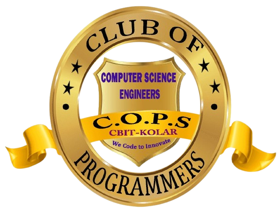

# 🚀 COPS Official Website

### Club of Programmers — C Byregowda Institute of Technology

*"Building Confident Programmers Together"*

---

## ✨ What is This?

This is the **official website** for COPS — the student-led programming community at C Byregowda Institute of Technology. Built collaboratively by COPS members, this project represents our commitment to learning by doing, shipping real things, and growing together as developers.

> 🤝 **This project was built as a team.** Every section, component, and line of code was a collaborative effort by COPS members across skill levels — from first-timers pushing their first commit to experienced devs reviewing PRs.

---

## 🛠️ Tech Stack

| Layer | Technology |
|-------|-----------|
| Frontend Framework | React 18 + TypeScript |
| Build Tool | Vite |
| Styling | Tailwind CSS |
| UI Components | Radix UI (shadcn/ui) |
| Animations | Framer Motion |
| Icons | Lucide React |
| Forms | Formspree |
| Deployment | Vercel / Netlify / GitHub Pages |

---

## 👥 Built By The COPS Team

This project was a **club-wide collaboration**. Contributors worked on everything from component design and animations to content writing and deployment.

| Name | Role / Contribution |
|------|---------------------|
| `Deepak P S` | Tech Lead / Architecture & Development |
| `Bhanu Kiran R` | Operational Lead / Integration & Development |

> 💡 **Want your name here?** Submit a PR and contribute to the project!

---

## 📞 Contact

| | |
|--|--|
| 📧 Email | clubofprogrammerscops@gmail.com |
| 💼 LinkedIn | [Club of Programmers COPS](https://linkedin.com/company/club-of-programmers-cops) |

---

## 🙏 Acknowledgements

- [shadcn/ui](https://ui.shadcn.com/) — Beautiful, accessible UI components
- [Tailwind CSS](https://tailwindcss.com/) — Utility-first styling
- [Framer Motion](https://www.framer.com/motion/) — Smooth animations
- [Lucide React](https://lucide.dev/) — Clean, consistent icons
- [Formspree](https://formspree.io/) — Effortless form handling

---

**Made with ❤️ by the COPS Team**

*Every great programmer started somewhere. Your first PR matters. 🌟*

